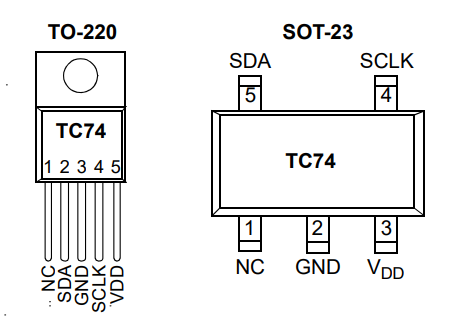

# TC74
An Arduino Library for TC74, Temperature Sensor.

For more technical details, please refer to the [datasheet.](https://ww1.microchip.com/downloads/en/DeviceDoc/21462D.pdf)

## Pinout


# TC74 Overview
TC74 is a thermal sensor with temperature resolution of 1 Celsius and I2C interface.

TC74 is internally programmed to have a default address (A5). But seven other addresses are available by custom order.
For hobby usage. If you desoldered TC74 from some kind of circuits, **please check its address before the usage.**

### TC74 I2C Addresses:
- A0: 0X48 (1001 000X)
- A1: 0X49 (1001 001X)
- A2: 0x4A (1001 010X)
- A3: 0X4B (1001 011X)
- A4: 0X4C (1001 100X)
- A5: 0X4D (1001 101X) *Default Address
- A6: 0X4E (1001 110X)
- A7: 0X4F (1001 111X)

## How To Use The Library
Include the library, then simply create an object like this:
```C
#include <TC74.h>
TC74 tmp(0X4D);
```
Then in the setup function of Arduino IDE:
```C
void setup(){
  tmp.begin();
  ...
```
To use this library with other I2C ports, you can simply create a TwoWire object then parse it into the 'begin' function:
```C
// ESP32
#define I2C_SDA 33
#define I2C_SCL 32

TwoWire esp = TwoWire(0);
TC74 tmp(0x4D);

void setup(){
  esp.begin(I2C_SDA, I2C_SCL, 1000000);
  tmp.begin(&esp);
}
```

## Methods
```C
void begin(TwoWire &wirePort = Wire);
```
Initiate the TC74 library.

Can be configured to use other I2C ports from a 'TwoWire' object. For default I2C port, just leave the parameter blank.

```C
short readTemperatureC();
```
Read the temperature from the sensor, return as Celsius value.

```C
float readTemperatureF();
```
Read the temperature from the sensor, return as Fahrenheit value.

```C
float readTemperatureK();
```
Read the temperature from the sensor, return as Kelvin value.

**IF THE DEVICES ARE NOT FOUND OR THE BUS IS CONNECTED INCORRECTLY, ALL ABOVE FUNCTIONS WILL RETURN AS -999.**

```C
void TC74Mode(bool mode);
```
Configure the power mode of TC74. Accept literals ('NORMAL' or 'STANDBY').

| mode | operation | literals |
|------|-----------|----------|
| logic 0 | NORMAL | NORMAL   |
| logic 1 | STANDBY | STANDBY |

**NORMAL = Operate in Normal Mode<br>**
**STANDBY = Operate in Standby Mode (A/D converter is halted and the temperature data registers are frozen until return into normal mode)**

```C
bool isStandby();
````
Check if TC74 is in STANDBY mode or not.<br>
This function can be used to check if the device is ready for conversion or not.
